# KGSM Execution Flows

This document provides a comprehensive overview of KGSM's execution flows, showing what happens when users run different commands. These diagrams focus on the external behavior and user experience rather than internal implementation details.

## Overview of All Command Flows

## 1. Instance Creation Flow

**Command:** `kgsm.sh --create BLUEPRINT [options]`

This is the primary workflow for setting up a new game server instance.

```mermaid
graph TD
    A["kgsm.sh --create BLUEPRINT<br/>[--install-dir DIR] [--version VER] [--name NAME]"] --> B["Validate Blueprint Exists"]
    B --> |"Blueprint Found"| C["Generate Instance Identifier"]
    B --> |"Blueprint Not Found"| Z1["❌ Error: Blueprint not found"]

    C --> D["Create Instance Configuration"]
    D --> E["Create Directory Structure<br/>(working, backups, install, saves, temp, logs)"]
    E --> F["Generate Management Files<br/>(instance.manage.sh, configs)"]
    F --> G["Setup Integrations<br/>(systemd, firewall, shortcuts)"]
    G --> H["Download Game Files<br/>(from Steam, web, etc.)"]
    H --> |"Download Success"| I["Deploy Game Files<br/>(extract, configure)"]
    H --> |"Download Failed"| Z2["❌ Error: Download failed"]

    I --> |"Deploy Success"| J["Save Version Information"]
    I --> |"Deploy Failed"| Z3["❌ Error: Deploy failed"]

    J --> K["✅ Instance Created Successfully<br/>Ready to start"]

    style A fill:#e3f2fd
    style K fill:#e8f5e8
    style Z1 fill:#ffebee
    style Z2 fill:#ffebee
    style Z3 fill:#ffebee
```

### What Happens:
1. **Validation**: KGSM checks if the specified blueprint exists and is valid
2. **Instance Setup**: Creates a unique instance identifier and configuration
3. **Directory Creation**: Sets up the complete directory structure for the game server
4. **File Generation**: Creates management scripts and configuration files
5. **Integration Setup**: Configures optional features (systemd services, firewall rules, shortcuts)
6. **Game Download**: Downloads the game server files from the appropriate source
7. **Deployment**: Extracts and configures the game files for operation
8. **Finalization**: Saves version information and marks the instance as ready

### User Experience:
- User provides a blueprint name and optional parameters
- KGSM handles all the complexity of setup automatically
- Results in a fully configured, ready-to-run game server instance

## 2. Instance Removal Flow

**Command:** `kgsm.sh --remove INSTANCE`

This workflow completely removes an instance and all associated files.

```mermaid
graph TD
    A["kgsm.sh --remove INSTANCE"] --> B["Validate Instance Exists"]
    B --> |"Instance Found"| C["Remove Integration Files<br/>(systemd, firewall, shortcuts)"]
    B --> |"Instance Not Found"| Z1["❌ Error: Instance not found"]

    C --> D["Remove Management Files<br/>(instance.manage.sh, configs)"]
    D --> E["Remove Directory Structure<br/>(all instance data and files)"]
    E --> F["Remove Instance Configuration<br/>(from instances registry)"]
    F --> G["✅ Instance Removed Successfully<br/>All data deleted"]

    style A fill:#e3f2fd
    style G fill:#e8f5e8
    style Z1 fill:#ffebee
```

### What Happens:
1. **Validation**: Confirms the instance exists
2. **Integration Cleanup**: Removes systemd services, firewall rules, and shortcuts
3. **File Cleanup**: Removes management scripts and configuration files
4. **Data Removal**: Deletes all instance directories and game data
5. **Registry Cleanup**: Removes the instance from KGSM's instance registry

### User Experience:
- Simple command completely removes all traces of an instance
- No manual cleanup required
- Irreversible operation - all data is permanently deleted

## 3. Blueprint Management Flow

**Command:** `kgsm.sh --blueprints [options]`

This workflow helps users discover and examine available game server templates.

```mermaid
graph TD
    A["kgsm.sh --blueprints"] --> B{Blueprint Command?}

    B --> C["--list"]
    B --> D["--list --detailed"]
    B --> E["--list --custom"]
    B --> F["--list --default"]
    B --> G["--info BLUEPRINT"]
    B --> H["--find BLUEPRINT"]

    C --> C1["📋 Show All Available Blueprints<br/>(native & container)"]
    D --> D1["📋 Show Detailed Blueprint Info<br/>(with descriptions, ports, etc.)"]
    E --> E1["📋 Show User-Created Blueprints<br/>(from custom directory)"]
    F --> F1["📋 Show Default Blueprints<br/>(built-in game templates)"]
    G --> G1["📄 Display Blueprint Contents<br/>(configuration details)"]
    H --> H1["📍 Show Blueprint File Path<br/>(absolute path location)"]

    C --> I["Optional: --json flag"]
    D --> I
    E --> I
    F --> I

    I --> I1["📤 Output in JSON Format<br/>(machine-readable)"]

    style A fill:#e3f2fd
    style C1 fill:#e8f5e8
    style D1 fill:#e8f5e8
    style E1 fill:#e8f5e8
    style F1 fill:#e8f5e8
    style G1 fill:#e8f5e8
    style H1 fill:#e8f5e8
    style I1 fill:#fff3e0
```

### What Happens:
- **List Operations**: Display available blueprints in various formats
- **Info Operations**: Show detailed information about specific blueprints
- **Find Operations**: Locate blueprint files on the filesystem
- **JSON Output**: Provide machine-readable output for automation

### User Experience:
- Users can discover what games are available for installation
- Detailed information helps users understand what they're installing
- JSON output enables automation and integration with other tools

## 4. Instance Listing Flow

**Command:** `kgsm.sh --instances [options]`

This workflow shows users their installed game server instances.

```mermaid
graph TD
    A["kgsm.sh --instances"] --> B{Instance Command?}

    B --> C["--list"]
    B --> D["--list --detailed"]
    B --> E["--list BLUEPRINT"]
    B --> F["--list BLUEPRINT --detailed"]

    C --> C1["📋 Show All Installed Instances<br/>(name, blueprint, status)"]
    D --> D1["📋 Show Detailed Instance Info<br/>(paths, config, resources)"]
    E --> E1["📋 Show Instances of Specific Game<br/>(filtered by blueprint)"]
    F --> F1["📋 Show Detailed Info for Game Type<br/>(filtered + detailed)"]

    C --> G["Optional: --json flag"]
    D --> G
    E --> G
    F --> G

    G --> G1["📤 Output in JSON Format<br/>(machine-readable)"]

    style A fill:#e3f2fd
    style C1 fill:#e8f5e8
    style D1 fill:#e8f5e8
    style E1 fill:#e8f5e8
    style F1 fill:#e8f5e8
    style G1 fill:#fff3e0
```

### What Happens:
- **General Listing**: Shows all instances with basic information
- **Detailed Listing**: Provides comprehensive information about instances
- **Filtered Listing**: Shows only instances of a specific game type
- **JSON Output**: Enables automation and monitoring

### User Experience:
- Quick overview of all managed game servers
- Detailed information for troubleshooting and monitoring
- Filtering helps manage large numbers of instances

## 5. Instance Operations Flow

**Command:** `kgsm.sh --instance INSTANCE [operation]`

This is the primary interface for managing individual game server instances.

```mermaid
graph TD
    A["kgsm.sh --instance INSTANCE"] --> B{Operation Type?}

    B --> C["Information Commands"]
    B --> D["Server Control"]
    B --> E["Maintenance"]

    C --> C1["--info<br/>📄 Show instance configuration"]
    C --> C2["--status<br/>📊 Show runtime status & resources"]
    C --> C3["--logs [--follow]<br/>📝 View server logs"]
    C --> C4["--is-active<br/>❓ Check if server is running"]
    C --> C5["--backups<br/>💾 List available backups"]
    C --> C6["--version [--installed|--latest]<br/>🔢 Show version information"]

    D --> D1["--start<br/>▶️ Launch the server"]
    D --> D2["--stop<br/>⏹️ Shutdown the server"]
    D --> D3["--restart<br/>🔄 Stop and start server"]
    D --> D4["--save<br/>💾 Trigger server save"]
    D --> D5["--input 'COMMAND'<br/>⌨️ Send command to server console"]

    E --> E1["--check-update<br/>🔍 Check for available updates"]
    E --> E2["--update<br/>⬆️ Update to latest version"]
    E --> E3["--create-backup<br/>💾 Create backup of current state"]
    E --> E4["--restore-backup NAME<br/>📦 Restore from backup"]
    E --> E5["--modify --add/--remove FEATURE<br/>⚙️ Manage integrations (systemd, ufw, etc.)"]

    style A fill:#e3f2fd
    style C fill:#e1f5fe
    style D fill:#e8f5e8
    style E fill:#fff3e0
```

### What Happens:

#### Information Commands:
- Provide visibility into instance state and configuration
- Enable monitoring and troubleshooting
- Support both human-readable and machine-readable output

#### Server Control:
- Direct operational control over the game server process
- Safe server lifecycle management
- Interactive server console access

#### Maintenance:
- Keep instances updated and backed up
- Manage optional integrations and features
- Recovery and restoration capabilities

### User Experience:
- Complete control over each game server instance
- Clear separation between information, control, and maintenance operations
- Consistent command structure across all instance operations

## 6. Interactive Mode and System Commands

**Commands:** `kgsm.sh --interactive` and system commands

These provide user-friendly interfaces and system-level operations.

```mermaid
graph TD
    A["kgsm.sh --interactive"] --> B["🎯 Launch Interactive Menu"]
    B --> C["User Selects Action from Menu"]
    C --> D["Execute Selected Command"]
    D --> E["Return to Main Menu"]
    E --> C
    E --> F["Exit Interactive Mode"]

    G["kgsm.sh [System Commands]"] --> H{System Command?}
    H --> I["--help<br/>📖 Show usage information"]
    H --> J["--version<br/>🔢 Show KGSM version"]
    H --> K["--check-update<br/>🔍 Check for KGSM updates"]
    H --> L["--update<br/>⬆️ Update KGSM itself"]
    H --> M["--migrate<br/>🔄 Migrate existing instances"]
    H --> N["--config<br/>⚙️ Edit KGSM configuration"]
    H --> O["--ip<br/>🌐 Show server's external IP"]

    style A fill:#fce4ec
    style B fill:#fce4ec
    style G fill:#e0f2f1
```

### Interactive Mode:
- Provides a menu-driven interface for users who prefer GUIs
- Guides users through available operations
- Suitable for occasional users or complex multi-step operations

### System Commands:
- Manage KGSM itself rather than game server instances
- Provide system information and maintenance capabilities
- Support automation and integration with server management tools

## Command Summary by User Intent

| User Goal | Command Pattern | Primary Flow |
|-----------|----------------|--------------|
| **Create a new game server** | `--create BLUEPRINT` | Instance Creation Flow |
| **Remove a game server** | `--remove INSTANCE` | Instance Removal Flow |
| **See available games** | `--blueprints --list` | Blueprint Management Flow |
| **See my game servers** | `--instances --list` | Instance Listing Flow |
| **Control a game server** | `--instance NAME --start/--stop` | Instance Operations Flow |
| **Monitor a game server** | `--instance NAME --status/--logs` | Instance Operations Flow |
| **Update a game server** | `--instance NAME --update` | Instance Operations Flow |
| **Use a menu interface** | `--interactive` | Interactive Mode |
| **Get help or system info** | `--help`, `--version`, etc. | System Commands |

## Error Handling Patterns

All flows include consistent error handling:

- **Validation Errors**: Commands validate inputs before taking action
- **Dependency Errors**: Missing files or failed operations are clearly reported
- **Permission Errors**: File system and network access issues are handled gracefully
- **State Errors**: Conflicting operations (e.g., starting an already running server) are prevented

## Integration Points

KGSM flows integrate with external systems:

- **systemd**: Service management for automatic startup
- **UFW**: Firewall management for network security
- **Steam**: Game file downloading and updating
- **Docker**: Container-based game server deployment
- **File System**: Organized directory structures and configuration management

This documentation provides the high-level view of what KGSM does without diving into implementation details, helping users understand the tool's capabilities and workflows.
